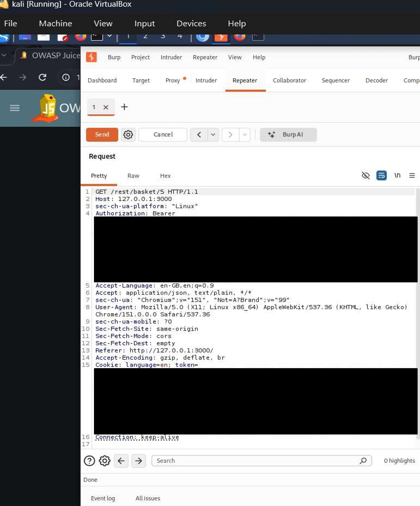
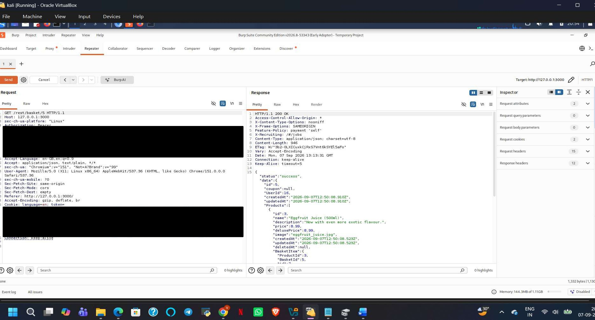

# A01:2025 — Broken Access Control

## Finding

**Vulnerability:** Insecure Direct Object Reference (IDOR)

**Status:** Confirmed

**Severity:** High

**Affected Functionality:** Basket API

**Endpoint:** `GET /rest/basket/{id}`

---

## Description

The application was found to be vulnerable to Insecure Direct Object Reference (IDOR), a form of broken access control.

The basket API uses a user-controlled basket identifier in the request. During testing, modifying the basket identifier allowed access to another user's basket data.

This demonstrated that the application did not adequately enforce object-level authorization for the requested resource.

---

## Testing Methodology

1. The basket functionality of OWASP Juice Shop was identified during application testing.
2. Requests to the basket API were intercepted using Burp Suite.
3. The basket identifier in the request URL was modified.
4. The modified request was forwarded to the application.
5. The application's response was examined to determine whether access to the referenced object was properly authorized.

---

## Observed Result

Changing the basket identifier resulted in access to another user's basket.

This confirmed that authorization was being determined based on the supplied object identifier without sufficient verification that the requesting user was authorized to access that object.

---

## Security Impact

An attacker who can manipulate object identifiers may be able to access data belonging to other users.

Depending on the affected functionality and data, broken object-level authorization can lead to:

- Unauthorized access to other users' data
- Privacy violations
- Exposure of sensitive application information
- Unauthorized modification of resources where write access is also affected

---

## Root Cause

The application did not adequately enforce server-side authorization checks for the requested basket object.

The server should verify that the authenticated user has permission to access the specific basket associated with the supplied identifier.

---

## Remediation

Recommended controls include:

1. Implement server-side object-level authorization checks.
2. Verify ownership of every requested basket before returning its data.
3. Do not rely solely on user-supplied object identifiers.
4. Return an appropriate authorization error when access is not permitted.
5. Apply authorization checks consistently across all object-access endpoints.

---

## Evidence

Screenshots below show the intercepted request with the modified basket identifier and the resulting response containing another user's basket data. Sensitive values (session tokens, cookies) have been redacted prior to publishing.

---

## Environment

**Application:** OWASP Juice Shop

**Testing Environment:** Local authorized laboratory environment

**Tools:** Kali Linux, Burp Suite, Firefox/Burp Suite Browser

**Assessment Type:** Web Application Vulnerability Assessment

---

## Disclaimer

This finding was identified in an intentionally vulnerable application within an authorized laboratory environment. The testing was performed for educational and security assessment purposes.
