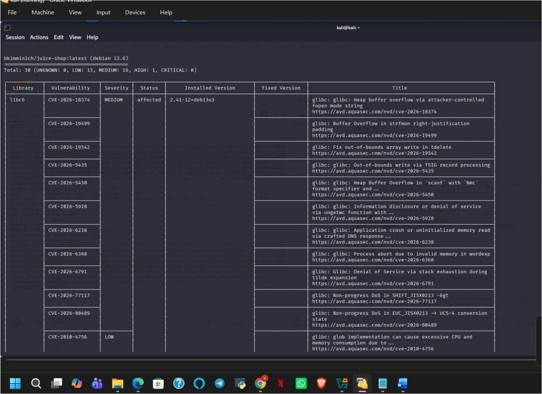

# A03:2025 — Software Supply Chain Failures

## Finding

**Vulnerability:** Vulnerable Third-Party Software Dependencies

**Status:** Confirmed

**Severity:** High

**Affected Functionality:** Application dependencies and externally sourced software components

---

## Description

The application was found to rely on multiple third-party dependencies containing publicly known vulnerabilities.

A dependency vulnerability scan was performed against the application's package dependencies, identifying several outdated or vulnerable libraries, including `uuid` and `ws`, for which fixed versions are publicly available.

Reliance on vulnerable third-party components introduces security weaknesses into the application that are outside the application's own codebase but still directly affect its overall security posture.

---

## Testing Methodology

1. The application's dependency manifest was reviewed to identify third-party libraries in use.
2. A dependency vulnerability scan was performed against the application's installed packages.
3. Scan results were reviewed to identify known vulnerabilities (CVEs) affecting the installed dependency versions.
4. Each flagged dependency was cross-referenced against its corresponding security advisory to confirm the vulnerability and identify the fixed version.

---

## Observed Result

The scan reported 30 vulnerabilities across the application's dependencies: 13 low, 16 medium, and 1 high severity.

Affected packages included `uuid` and `ws`, both of which had publicly documented security advisories and available fixed versions.

This confirmed that the application was running dependency versions with known, unpatched security issues.

---

## Security Impact

Vulnerable third-party dependencies can introduce exploitable weaknesses into the application environment even when the application's own code is otherwise secure.

Depending on the specific vulnerability, impact can include:

- Remote code execution or denial of service via a vulnerable library
- Exposure of the application to publicly documented exploits
- Increased attack surface inherited from unmaintained or outdated packages
- Compounding risk when vulnerable dependencies are used in security-sensitive functionality

---

## Root Cause

The application was deployed with outdated dependency versions that had not been updated to incorporate available security patches, and no dependency vulnerability monitoring process was evident.

---

## Remediation

Recommended controls include:

1. Update vulnerable dependencies such as `uuid` and `ws` to secure versions that contain the relevant security fixes.
2. Establish a routine dependency vulnerability scanning process (e.g., `npm audit`, Snyk, or equivalent) as part of the development workflow.
3. Monitor security advisories for all third-party packages in active use.
4. Adopt a patch-management policy defining acceptable timeframes for remediating dependencies by severity.
5. Where feasible, minimize the number of third-party dependencies to reduce overall supply-chain attack surface.

---

## Evidence

Screenshots below show the dependency vulnerability scan results, including the identified vulnerable packages and their associated severity ratings. Sensitive values have been redacted prior to publishing.

`
``

---

## Environment

**Application:** OWASP Juice Shop

**Testing Environment:** Local authorized laboratory environment

**Tools:** Kali Linux, npm audit / dependency scanner, Burp Suite

**Assessment Type:** Web Application Vulnerability Assessment

---

## Disclaimer

This finding was identified in an intentionally vulnerable application within an authorized laboratory environment. The testing was performed for educational and security assessment purposes.
