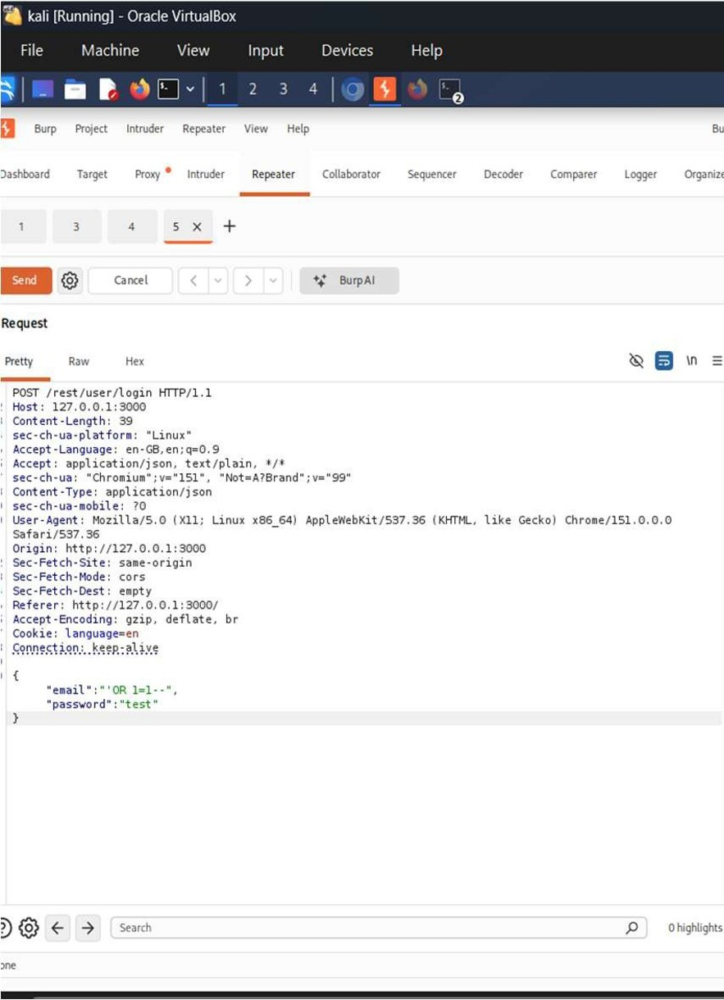

# A05:2025 — Injection

## Finding

**Vulnerability:** SQL Injection in User Authentication

**Status:** Confirmed

**Severity:** Critical

**Affected Functionality:** Login Authentication

**Endpoint:** `POST /rest/user/login`

---

## Description

Injection vulnerabilities occur when untrusted input is passed to an interpreter (such as a SQL query engine) without proper validation, sanitization, or parameterization, allowing an attacker to alter the intended logic of the query.

During testing, the login functionality of OWASP Juice Shop was found to be vulnerable to SQL Injection. A crafted payload submitted in the email field of the login request altered the underlying authentication query's logic, resulting in successful authentication without valid credentials.

---

## Testing Procedure

1. The login functionality of OWASP Juice Shop was identified during application testing.
2. The login request was intercepted using Burp Suite to examine the request structure and parameters.
3. A SQL injection payload was crafted and submitted in the email field: `' OR 1=1--`
4. The request was forwarded to the application with the password field left arbitrary.
5. The application's response was examined to determine whether the injected payload altered the authentication logic.

---

## Observation

Submitting `' OR 1=1--` in the email field resulted in a successful authentication response. The server returned **HTTP 200 OK**, along with a valid authentication token and the account identifier `admin@juice-shop.op`.

This confirmed that the payload altered the intended SQL query logic, causing the query to evaluate as true regardless of the supplied credentials, and resulted in authentication as an administrative account without knowledge of the actual password.

---

## Security Impact

SQL Injection in an authentication mechanism represents a direct and severe compromise of application security. Successful exploitation in this assessment resulted in:

- Complete authentication bypass without valid credentials
- Unauthorized access to an administrative account
- Potential access to all functionality and data available to the compromised account
- Demonstration that the underlying query logic can be manipulated by attacker-controlled input, indicating broader risk across any other unsanitized query in the application

Given the direct path to privileged access, this finding represents one of the most severe risks identified during the assessment.

---

## Root Cause

The application constructed SQL queries using unsanitized, directly concatenated user input rather than parameterized queries or prepared statements, allowing attacker-supplied input to alter the query's logical structure.

---

## Remediation

Recommended controls include:

1. Use parameterized queries or prepared statements for all database interactions; never concatenate user input directly into SQL statements.
2. Apply strict server-side input validation on all authentication-related fields.
3. Enforce the principle of least privilege for the database account used by the application.
4. Implement a Web Application Firewall (WAF) as a defense-in-depth control against injection attempts.
5. Conduct regular static and dynamic security testing (SAST/DAST) targeting injection vulnerabilities.
6. Review all other query-constructing endpoints in the application for the same unsanitized-input pattern.

---

## Evidence

Screenshots below show the crafted SQL injection payload submitted in the login request and the resulting response confirming successful authentication bypass. Sensitive values have been redacted prior to publishing.

`
``

---

## Environment

**Application:** OWASP Juice Shop

**Testing Environment:** Local authorized laboratory environment

**Tools:** Kali Linux, Burp Suite, Firefox/Burp Suite Browser

**Assessment Type:** Web Application Vulnerability Assessment

---

## Disclaimer

This finding was identified in an intentionally vulnerable application within an authorized laboratory environment. The testing was performed for educational and security assessment purposes.
