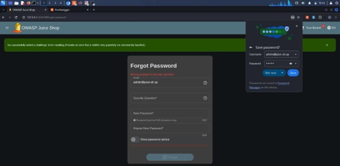
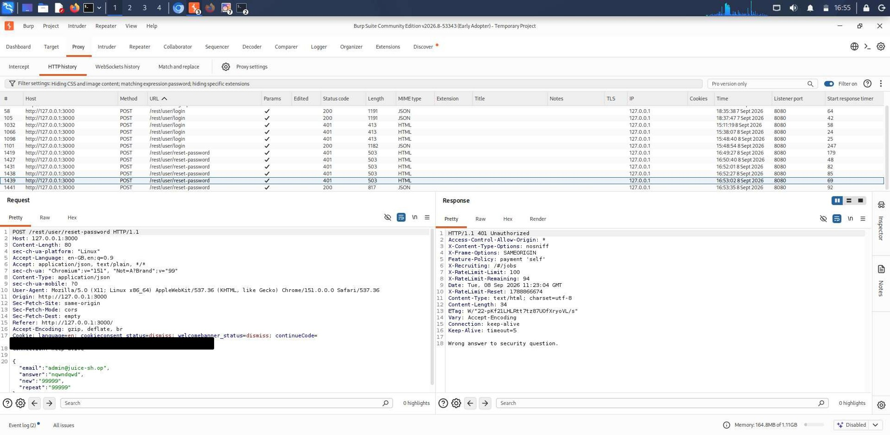
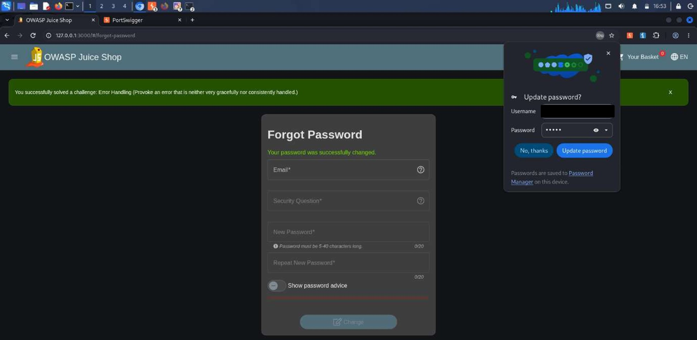

# A06:2025 — Insecure Design

## Finding

**Vulnerability:** Insecure Design of Password Recovery Mechanism (Security-Question-Based Reset)

**Status:** Confirmed

**Severity:** High

**Affected Functionality:** Forgot Password / Account Recovery

**Endpoint:** `POST /rest/user/reset-password`

---

## Description

Insecure Design refers to security weaknesses that originate from the architecture or design of an application's functionality, rather than from an implementation defect. Unlike a coding bug, an insecure design flaw can remain present even when the feature is implemented exactly as specified, because the underlying design choice itself is inadequate to resist common attack patterns.

The application's password-recovery functionality relies solely on a knowledge-based security question to verify a user's identity before allowing a password reset. No secondary out-of-band verification step, such as an emailed reset token or link, is used to confirm that the party performing the reset is the legitimate account owner.

This finding is also connected to the **A02:2025 Security Misconfiguration** finding, where security-question answers for certain accounts were found to be exposed through the application configuration endpoint. The combination of a low-entropy, single-factor recovery design and separately disclosed answer data increases the practical risk of account takeover.

---

## Testing Procedure

1. The Forgot Password functionality was accessed at `http://127.0.0.1:3000/#/forgot-password`.
2. The email address `admin@juice-sh.op` was submitted to retrieve the associated security question.
3. An incorrect answer was submitted to the displayed security question.

   

   *Figure: Browser view showing "Wrong answer to security question" error on the Forgot Password page.*

5. The request and response were captured and inspected using Burp Suite.
6. The incorrect-answer submission was repeated multiple times in succession to observe the application's rate-limiting behavior, and the response headers were examined for any rate-limit indicators.

   

   *Figure: Burp Suite Repeater/HTTP history view showing the `POST /rest/user/reset-password` request body (`"email":"admin@juice-sh.op"`, `"answer":"nqwndqwd"`...) and the 401 Unauthorized response with the `X-RateLimit-*` headers visible.*

8. A second test account was used to complete the flow with the correct security-question answer, followed by submission of a new password.

   

    *Figure: Browser view showing "Your password was successfully changed" on the second test account.*

10. The application's response to the successful reset was recorded, and checked for any indication of an account-owner notification.

---

## Observation

Submitting an incorrect answer to the security question for the `admin@juice-sh.op` account returned an **HTTP 401 Unauthorized** response with the message *"Wrong answer to security question."*

The response headers indicated that the endpoint enforces rate-limiting:
X-RateLimit-Limit: 100
X-RateLimit-Remaining: 94
X-RateLimit-Reset: 1788866674

This confirms that repeated requests from the same source are tracked and would eventually be blocked once the limit is exhausted within the reset window. However, this control appears to be applied at the **request/IP level** rather than being scoped to the specific account under attack. An attacker distributing reset attempts across multiple source IP addresses could therefore still perform a sustained brute-force attempt against a single victim account's security-question answer, without triggering the limit for that account specifically.

When the correct answer was supplied for the second test account, the application returned **HTTP 200 OK** with confirmation that the password was successfully changed. No email or other out-of-band notification to the account owner was observed as part of this flow.

---

## Security Impact

While the endpoint applies IP-based rate-limiting, this does not fully mitigate the underlying design weakness: security-question answers remain a single, static, low-entropy factor for account recovery, and the rate-limiting control is not scoped to the targeted account. An attacker using multiple source IP addresses could still attempt a sustained brute-force of the security-question answer for a specific victim account.

Additionally, because no notification is sent to the account owner upon a password-reset attempt or success, a compromised account may go unnoticed by its legitimate owner, delaying detection and response.

This finding also compounds the impact of the **A02:2025** finding: where a security-question answer has already been disclosed through the configuration endpoint, this design flaw becomes directly and immediately exploitable rather than theoretical.

---

## Root Cause

The probable root cause is reliance on a single, low-entropy, static, knowledge-based factor for account recovery. While basic IP-based rate-limiting is present at the endpoint, it does not fully compensate for the underlying design choice, since it is not account-scoped and provides no protection against distributed brute-force attempts. This remains a design-level weakness rather than an implementation defect, as the feature functions exactly as it was designed to.

---

## Remediation

1. Replace or supplement security-question-based recovery with a token-based reset mechanism (a time-limited, single-use link sent to the registered email address).
2. If security questions are retained, require high-entropy, user-defined answers rather than predictable or guessable ones.
3. Apply rate-limiting and lockout controls at the **account level**, not solely per-IP, so that brute-force attempts against a specific target cannot be distributed across multiple source addresses to bypass the limit.
4. Send a notification to the account owner's registered email whenever a password-reset attempt or successful reset occurs.
5. Introduce threat modeling during the design phase of authentication-adjacent features to identify this class of weakness prior to implementation.
6. Consider requiring step-up verification (e.g., MFA) for password changes on sensitive or privileged accounts.

---

## Evidence

Screenshots above show: (1) the incorrect security-question-answer error, (2) the Burp Suite request/response revealing IP-scoped rate-limiting via `X-RateLimit-*` headers, and (3) the successful password reset on the second test account. Sensitive values have been redacted prior to publishing.

---

## Environment

**Application:** OWASP Juice Shop

**Testing Environment:** Local authorized laboratory environment

**Tools:** Kali Linux, Burp Suite, Firefox/Burp Suite Browser

**Assessment Type:** Web Application Vulnerability Assessment

---

## Disclaimer

This finding was identified in an intentionally vulnerable application within an authorized laboratory environment. The testing was performed for educational and security assessment purposes.
