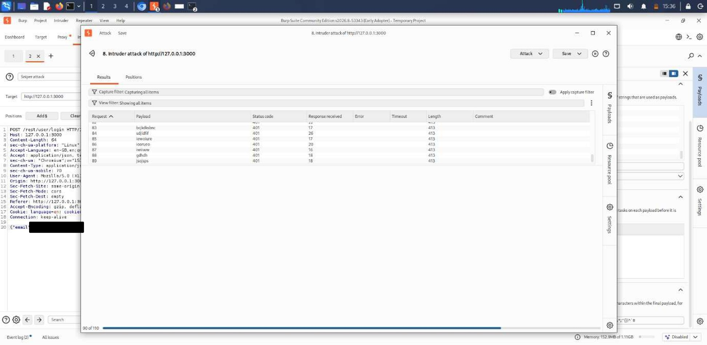
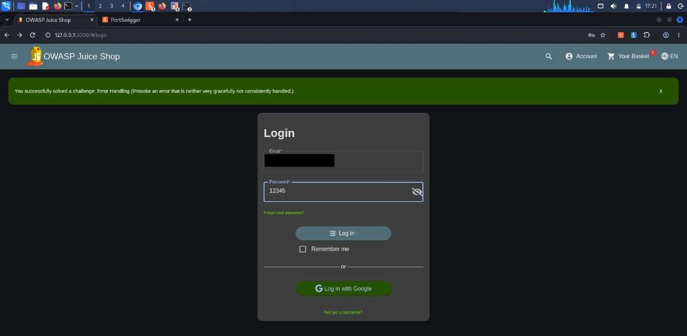

# A07:2025 — Authentication Failures

## Finding

**Vulnerability:** Authentication Weaknesses — (A) No Brute-Force Protection on Login, (B) Weak Password Policy

**Status:** Confirmed

**Severity:** High

**Affected Functionality:** User Authentication / Login / Registration

**Endpoints:** `POST /rest/user/login`, `POST /api/Users/` (registration)

---

## Description

Authentication Failures cover weaknesses in the mechanisms an application uses to verify user identity, including missing protections against credential guessing, absence of rate-limiting or lockout controls, and inadequate password strength requirements.

Two related but distinct weaknesses were identified during this assessment: first, the absence of brute-force protection on the login endpoint (Test A below); and second, an insufficient password policy that permits users to register accounts using trivially weak passwords (Test B below). Together, these weaknesses compound one another — a weak, easily-guessed password combined with no restriction on login attempts makes credential-guessing attacks significantly more practical.

Both findings are independent of the SQL injection vulnerability documented under A05:2025 and would remain exploitable even if that flaw were remediated.

---

## Testing Procedure

**A — Brute-force protection test:**

1. A login request to `POST /rest/user/login` was captured in Burp Suite Proxy using a test account.
2. The request was sent to Burp Suite Intruder with the password parameter set as the payload position.
3. A wordlist of common password values was loaded and a Sniper attack was executed.
4. Response status codes, lengths, and any rate-limiting/lockout indicators were observed across the attack.

   

   *Figure: Burp Suite Intruder Results tab showing repeated `POST /rest/user/login` requests, all returning 401 status codes with no throttling.*

**B — Password policy test:**

1. The registration page was accessed at `http://127.0.0.1:3000/#/register`.
2. A new account was registered using the password `12345`.
3. The application's response to the registration submission was observed (i.e., whether the weak password was accepted or rejected).
4. A subsequent login attempt was performed using the same account and password to confirm the weak password remained valid for authentication.

   

   *Figure: Browser view showing successful login on the OWASP Juice Shop login page using email and password `12345`, confirming the weak password was accepted at registration and remains valid for authentication.*

---

## Observation

**A — Brute-force protection:** Across the executed attack (110 total requests submitted), every request returned an **HTTP 401** status code with a consistent response length (413 bytes). No request returned a 429 Too Many Requests status, no CAPTCHA challenge was presented, and no account-lockout message was observed. This contrasts with the password-reset endpoint examined under **A06:2025**, which was observed to enforce a rate limit via `X-RateLimit-*` headers — indicating an inconsistency in authentication-related protections across the application.

**B — Weak password policy:** The application accepted a 5-character, all-numeric password (`12345`) during account registration, with no requirement for character complexity (uppercase, symbols, or non-sequential digits). The subsequent login confirms this account could be authenticated successfully using the same weak password, demonstrating that the weak credential remains usable for login rather than being flagged or restricted at any later stage.

---

## Security Impact

The combination of an unrestricted login endpoint (no rate-limiting or lockout) and a weak password policy (allowing trivially guessable passwords) significantly increases the practical feasibility of a successful credential-guessing attack. An attacker targeting an account protected only by a common, low-entropy password could reasonably expect to succeed within a small number of automated attempts, with no application-level control interrupting the attack.

This represents a viable attack path for unauthorized account access that is independent of, and would persist even after, remediation of the SQL injection vulnerability documented under A05:2025.

---

## Root Cause

The probable root causes are: (1) absence of authentication-specific protective controls — rate-limiting, progressive delays, account lockout, or CAPTCHA — on the login endpoint, unlike the password-reset endpoint which does enforce a request-based limit; and (2) a registration-time password policy that validates only password length (5–40 characters) without enforcing complexity requirements.

---

## Remediation

1. Implement rate-limiting on the login endpoint, consistent with the protection already applied to the password-reset endpoint.
2. Introduce temporary account lockout or progressive delay after a defined number of consecutive failed login attempts.
3. Add CAPTCHA or equivalent bot-detection challenges after repeated failed attempts from the same source.
4. Enforce a stronger password policy at registration, requiring a minimum complexity (e.g., mixed case, numbers, symbols) in addition to minimum length.
5. Check submitted passwords against a list of common/breached passwords and reject matches.
6. Log and alert on repeated failed authentication attempts against a single account, in line with the A09:2025 (Security Logging and Alerting Failures) recommendations.
7. Consider implementing multi-factor authentication for sensitive or privileged accounts.

---

## Evidence

Screenshots above show: (1) the Burp Suite Intruder attack against the login endpoint returning consistent 401 responses with no throttling, and (2) a successful login using the trivially weak password `12345`. Sensitive values have been redacted prior to publishing.

---

## Environment

**Application:** OWASP Juice Shop

**Testing Environment:** Local authorized laboratory environment

**Tools:** Kali Linux, Burp Suite (Intruder), Firefox/Burp Suite Browser

**Assessment Type:** Web Application Vulnerability Assessment

---

## Disclaimer

This finding was identified in an intentionally vulnerable application within an authorized laboratory environment. The testing was performed for educational and security assessment purposes.
