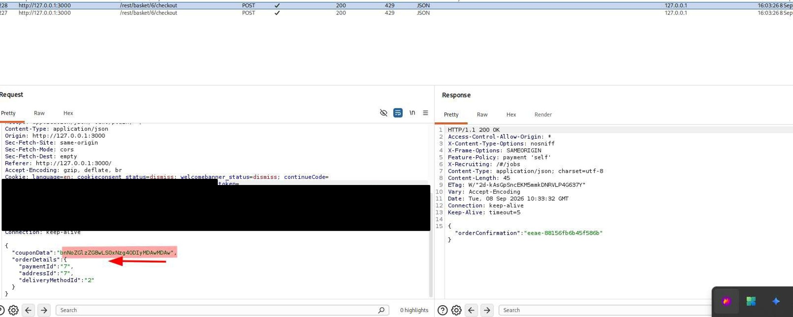
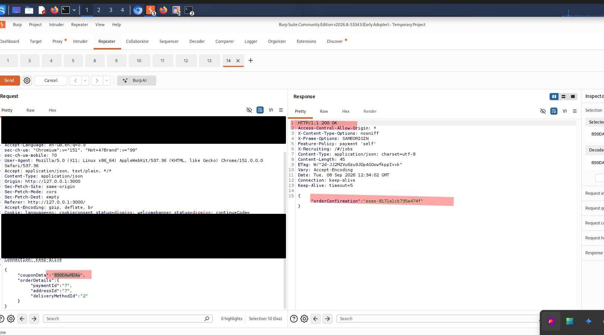
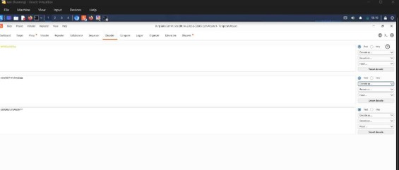

# A08:2025 — Software or Data Integrity Failures

## Finding

**Vulnerability:** Client-Controlled Coupon/Discount Data Accepted Without Server-Side Integrity Verification

**Status:** Confirmed

**Severity:** Medium

**Affected Functionality:** Order Checkout / Coupon Application

**Endpoint:** `POST /rest/basket/{id}/checkout`

---

## Description

Software or Data Integrity Failures occur when an application does not adequately verify that data or code originating from an untrusted source (such as the client) has not been tampered with before it is trusted or acted upon. This class of vulnerability often arises when server-side logic relies on client-supplied values for security- or business-critical decisions, rather than independently deriving or re-validating those values on the server.

During this assessment, the order-checkout request was examined. The request body included a **couponData** field containing a client-supplied, encoded value representing the coupon or discount information associated with the order, alongside **orderDetails** specifying the payment, address, and delivery method IDs.

The **couponData** value was modified within Burp Suite Repeater and the request was replayed. The server accepted the modified request and returned a successful order confirmation, indicating that the coupon/discount data was not independently re-validated against a trusted, server-side record of the coupon originally applied to the basket.

---

## Testing Procedure

1. A product was added to the basket and the checkout flow was initiated within the OWASP Juice Shop application.
2. Burp Suite was used to intercept the order-confirmation request submitted at the final checkout step.

   

    *Figure: Original coupon code.*

4. The request was sent to Burp Suite Repeater for controlled testing.
5. The `couponData` field value within the request body was modified.
6. The modified request was submitted to the application.

   

   *Figure: Burp Suite Repeater view showing the modified request body (`"couponData":"899DAwMDAw"`, along with `orderDetails` containing `paymentId`, `addressId`, `deliveryMethodId`) and the corresponding HTTP 200 OK response containing `"orderConfirmation":"eeae-8171a1cb735a4f4f"`.*

7. The server response was examined to determine whether the order was processed successfully despite the modified coupon data.
8. An attempt was made to decode the `couponData` value using Burp Suite Decoder to determine its structure.

   

   *Figure: Attempt to decode the coupon code.*

---

## Observation

The order-checkout request was found to include a `couponData` field within the request body, submitted alongside standard order details (`paymentId`, `addressId`, `deliveryMethodId`). This field appears to encode coupon or discount information associated with the order.

When the value of `couponData` was modified and the request was replayed, the application returned an **HTTP 200 OK** response and successfully generated an order confirmation, rather than rejecting the request or re-validating the coupon data against a trusted server-side source. This indicates that the server processes the order based on the coupon information supplied directly by the client, rather than independently verifying that the coupon was genuinely issued, valid, and unmodified.

An attempt was made to decode the `couponData` value using Burp Suite Decoder to determine its structure; however, the value did not correspond to standard Base64 encoding (its length was not a multiple of 4, and decoding did not yield readable output). This suggests the value is either an opaque, application-specific token or uses a non-standard encoding scheme. Regardless of its internal structure, the key finding — that a modified value was accepted by the server without rejection — remains valid, as the server processed the request successfully despite the alteration.

---

## Security Impact

If the coupon/discount value applied to an order can be modified by the client without adequate server-side verification, an attacker may be able to manipulate the discount applied to an order, resulting in financial loss to the business (e.g., applying a higher discount percentage than was legitimately authorized, or applying a discount without a valid coupon having been issued at all).

This represents a failure to maintain data integrity across the trust boundary between the client and server: the server is trusting client-supplied data for a business-critical calculation (the final order price) rather than deriving that value independently from validated, server-held records.

---

## Root Cause

The probable root cause is insufficient server-side validation of client-supplied order and coupon data. The checkout process appears to trust the `couponData` value provided in the request rather than independently re-verifying the coupon's validity, origin, and associated discount against server-side records before finalizing the order.

---

## Remediation

1. Validate all coupon/discount data server-side against a trusted, authoritative record before applying it to an order — never trust a client-supplied discount value directly.
2. Recalculate the final order total server-side based on verified product prices and validated coupon records, rather than accepting a client-provided total or discount figure.
3. Sign or cryptographically protect any coupon-related data that must be round-tripped through the client, and verify that signature server-side before processing.
4. Implement server-side checks to confirm a coupon has not already been redeemed, has not expired, and is valid for the specific order/user before finalizing checkout.
5. Log and monitor discrepancies between expected and submitted coupon/discount values to detect tampering attempts.
6. Perform regression testing after remediation to confirm that modified coupon data is rejected rather than silently accepted.

---

## Evidence

Screenshots above show: (1) the original coupon code in the checkout request, (2) the Burp Suite Repeater view with the modified `couponData` field and the resulting HTTP 200 OK order confirmation, and (3) the attempt to decode the coupon value. Sensitive values have been redacted prior to publishing.

---

## Environment

**Application:** OWASP Juice Shop

**Testing Environment:** Local authorized laboratory environment

**Tools:** Kali Linux, Burp Suite (Repeater, Decoder), Firefox/Burp Suite Browser

**Assessment Type:** Web Application Vulnerability Assessment

---

## Disclaimer

This finding was identified in an intentionally vulnerable application within an authorized laboratory environment. The testing was performed for educational and security assessment purposes.
