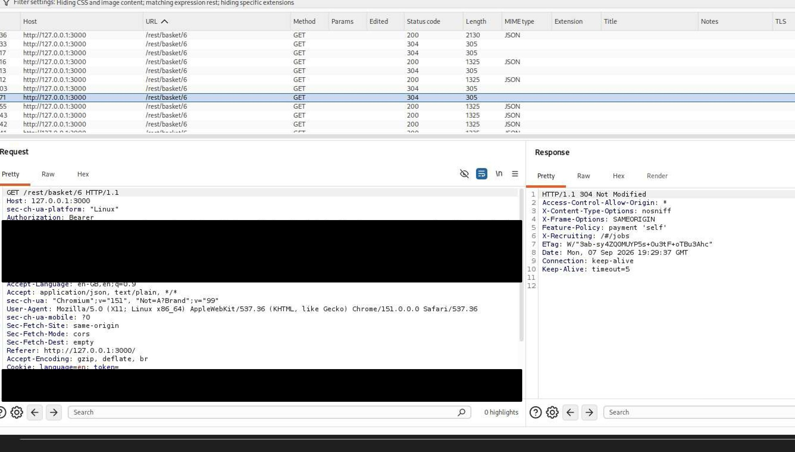
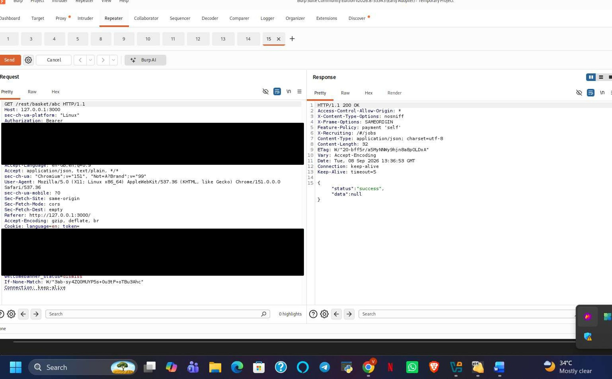

# A09:2025 — Security Logging and Alerting Failures

## Finding

**Vulnerability:** Absence of Observable Security Logging and Alerting for Anomalous and Malicious Activity

**Status:** Confirmed

**Severity:** Medium

**Affected Functionality:** Application-wide (Authentication, Basket API)

---

## Description

Security Logging and Alerting Failures occur when an application does not generate sufficient logs for security-relevant events, or when generated logs are not monitored and acted upon through an effective alerting mechanism. Without adequate logging and alerting, malicious activity can go undetected, delaying incident response and allowing an attacker to operate without triggering any defensive reaction from the application or its operators.

As a black-box assessment, this project could not directly inspect server-side log files. Instead, this finding is based on **observable application behavior** during testing — specifically, whether any of the clearly anomalous or malicious activity conducted during this assessment produced any client-visible indication of detection, flagging, or defensive response.

Three pieces of evidence support this finding: the SQL injection authentication bypass (A05:2025), the unthrottled brute-force attempt against the login endpoint (A07:2025), and the application's handling of a malformed basket-ID request during this testing phase.

---

## Testing Procedure

1. The SQL injection authentication bypass documented under **A05:2025** was reviewed for any indication of detection or defensive response (e.g., forced session termination, account flagging, alert banner).
2. The brute-force login attempt documented under **A07:2025** (110 requests via Burp Intruder) was reviewed for any change in application behavior over the course of the attack that would indicate detection.
3. A malformed request was submitted directly to the basket API using a non-numeric basket identifier: `GET /rest/basket/abc`.
4. The response was examined for any indication that the invalid/anomalous input was flagged, logged, or handled differently from a normal request.

   

   *Figure: Legitimate basket request, shown for comparison against the malformed request below.*

   

   *Figure: Burp Suite Repeater view showing the request `GET /rest/basket/abc` and the response `HTTP 200 OK` with body `{"status":"success","data":null}`.*

---

## Observation

**SQL injection (A05:2025):** The authentication bypass using `' OR 1=1--` succeeded and returned a valid authentication token with no observable client-side indication that the request had been flagged, blocked, or treated as anomalous by any security-monitoring mechanism.

**Brute-force login attempts (A07:2025):** Across 110 submitted login attempts against a single account, every response remained a uniform 401 Unauthorized with identical length and structure throughout the attack. No response at any point in the sequence indicated that the volume or pattern of attempts had been detected or was being treated differently from isolated failed logins.

**Malformed basket-ID request:** Submitting a non-numeric basket identifier (`abc`) resulted in an HTTP 200 OK response with `{"status":"success","data":null}`, rather than a 400 Bad Request or any error response. The malformed input was processed as though it were a normal, successful request rather than being surfaced as invalid or anomalous input worth flagging.

Across all three cases, no client-observable evidence — such as an error banner, session termination, CAPTCHA challenge, changed response pattern, or security notice — indicated that any of this activity was logged in a way that would trigger a meaningful alert.

---

## Security Impact

Without effective logging and alerting, security-relevant events such as authentication bypass attempts, brute-force login activity, and malformed/anomalous input can occur without detection. This significantly increases the time an attacker can operate undetected within the application (dwell time), delays incident response, and removes the opportunity for defenders to intervene before a security event escalates into a more serious compromise.

The lack of any observable difference in application behavior during genuinely malicious activity (SQL injection, brute-force) versus normal use suggests that, at minimum, client-facing indicators of detection are absent — and raises concern that server-side logging and alerting for these event types may be similarly inadequate or unmonitored.

---

## Root Cause

The probable root cause is the absence of, or inadequate configuration of, security event logging and alerting mechanisms for authentication failures, injection attempts, and malformed/anomalous requests.

The application does not appear to differentiate its handling or response for suspicious activity compared to normal application use.

---

## Remediation

1. Implement logging for security-relevant events, including failed login attempts, successful logins from unusual patterns, injection-pattern input, and malformed requests.
2. Configure alerting thresholds (e.g., N failed logins within a time window, injection-pattern detection) that notify security personnel in near-real-time.
3. Integrate application logs with a centralized logging/SIEM solution to enable correlation and anomaly detection across requests.
4. Ensure that malformed or unexpected input (such as non-numeric identifiers where numeric values are expected) is logged and, where appropriate, rejected with an explicit error rather than silently processed as successful.
5. Periodically test logging and alerting mechanisms (e.g., via simulated attack scenarios) to confirm they trigger as intended.
6. Ensure logs capture sufficient context (timestamp, source IP, endpoint, user identifier, and result) to support incident investigation, while avoiding logging of sensitive data such as full passwords or tokens.

---

## Evidence

Screenshots above show: (1) a legitimate basket request for comparison, and (2) the malformed basket-ID request (`GET /rest/basket/abc`) returning an HTTP 200 OK success response rather than an error. Sensitive values have been redacted prior to publishing.

---

## Environment

**Application:** OWASP Juice Shop

**Testing Environment:** Local authorized laboratory environment

**Tools:** Kali Linux, Burp Suite (Repeater, Intruder), Firefox/Burp Suite Browser

**Assessment Type:** Web Application Vulnerability Assessment

---

## Disclaimer

This finding was identified in an intentionally vulnerable application within an authorized laboratory environment. The testing was performed for educational and security assessment purposes.
